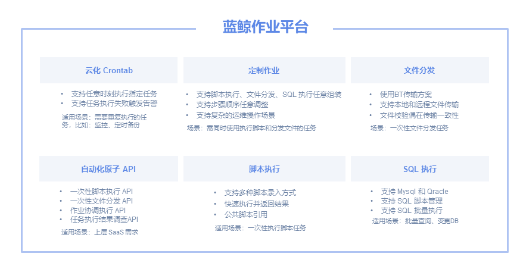
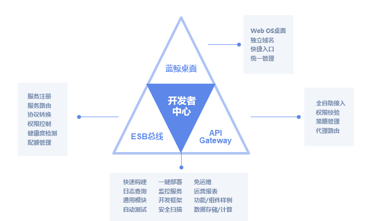
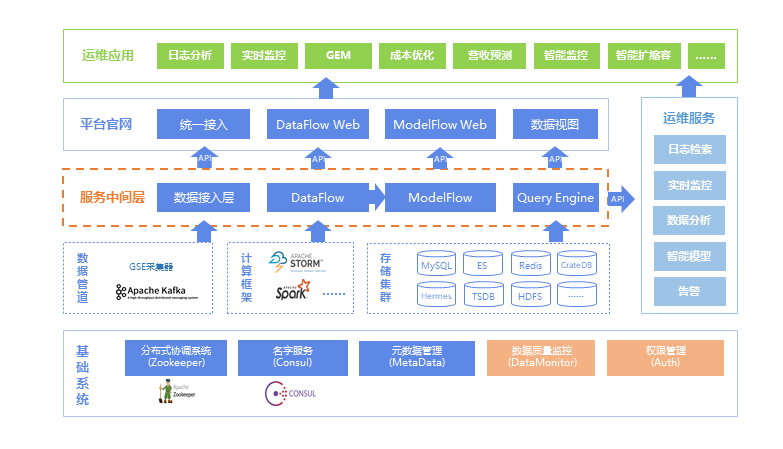
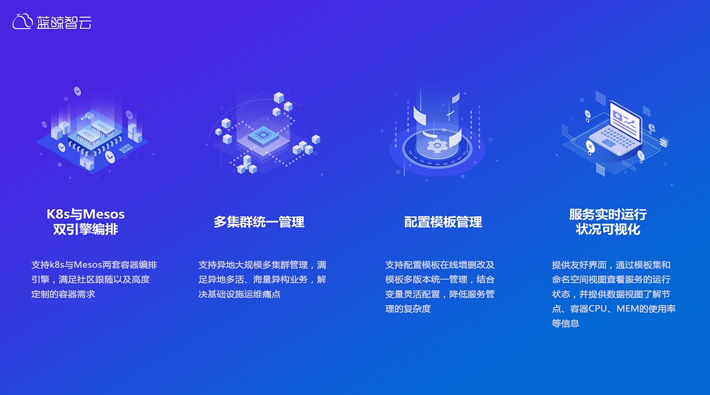

# 产品简介

## 原子平台

#### 管控平台

蓝鲸管控平台是蓝鲸体系的底层管控系统，是上层运维服务体系与底层 IaaS 的连接器，为上层提供指令、文件、数据的通道，支持直连模式、代理模式以及为达到最优连接指定级联路由的模式。

管控平台是典型的两层分布式 C/S 结构，主要包含智能的蓝鲸 Agent、提供各种服务的 Server 以及 zookeeper、redis、MySQL 等周边保障模块。其中蓝鲸 Agent 是部署在业务机器上的程序，每台业务机器仅部署一个蓝鲸 Agent，其他模块部署无具体要求，用户可以单独部署，也可以混合部署。

在整个蓝鲸体系中，管控平台无需直面用户，但其在体系中却是不可或缺的，它为其他平台模块提供了人机交互的通道与能力。管控平台主要提供了三种类型的服务能力：文件分发传输能力、命令实时执行与反馈的能力、大数据采集与传输的能力。

其功能详情见[《蓝鲸智云管控平台产品白皮书》](5.1/管控平台/产品简介/README.md)。

#### 配置平台
蓝鲸配置平台（CC）是一款面向应用的 CMDB，在 ITIL 体系里，配置管理数据库（CMDB）是构建其它流程的基础，配置平台作为面向业务层面的 CMDB, 为蓝鲸体系的其它平台提供了各种运维场景的配置数据服务，存储与管理企业 IT 架构中设备的各种配置信息，它与所有服务支持和服务交付流程都紧密相联，支持这些流程的运转、发挥配置信息的价值，同时依赖于相关流程保证数据的准确性。

配置平台提供的主要功能有主机管理、业务拓扑、业务管理、资源池管理、自定义属性管理、操作审计等。

其功能详情见[《蓝鲸智云配置平台产品白皮书》](5.1/配置平台/产品简介/README.md)。

#### 作业平台
蓝鲸作业平台（Job）是一套底层基于管控之上的基础运维操作平台，并且具备海量的并发处理能力，除了支持脚本执行、文件拉取 / 分发、定时执行等一系列可实现的基础运维场景以外，还运用流程化的理念很好的将零碎的单个任务组装成一个作业流程。同时，可通过平台提供的 API 实现对任意作业的调用、查看等操作，与其它平台或系统联动，实现调度自动化。

作业平台的主要功能有：快速传输文件、web 化脚本管理、支持批量高效执行、流程式管理，一切皆 “作业” 等。

其功能详情见[《蓝鲸智云作业平台产品白皮书》](5.1/作业平台/产品介绍/产品介绍.md)。

#### PaaS 平台
蓝鲸 PaaS 平台是一个开放的平台，又称蓝鲸 PaaS，让用户可以简单、快速地创建、部署和管理应用，他提供了完善的前后台开发框架、服务总线（ESB）、调度引擎、公共组件等模块，帮助用户快速、低成本、免运维地构建支撑工具和运营系统。PaaS 平台为一个应用从创建到部署，再到后续的维护管理提供了完善的自助化和自动化服务，如日志查询、监控告警等，从而使用户可以将全部精力投入到应用的开发之中。

PaaS 平台的主要功能有：支持多语言的开发框架 / 样例、免运维托管、SaaS 运营数据可视化、企业服务总线（API Gateway）、可拖拽的前端服务（MagicBox）等。

其功能详情见[《蓝鲸智云 PaaS 平台产品白皮书》](5.1/PaaS平台/产品简介/README.md)。

#### 数据平台

蓝鲸数据平台是一个专注于运维领域的低门槛大数据平台，提供了数据接入、清洗、计算、存储、查询和分析的全流程自助化大数据服务，运维人员可以通过统一数据接入、可视化计算任务配置、可视化建模、统一查询等功能，快速的构建基于大数据的可视化、智能化运维支撑工具。

数据平台的主要功能有：统一数据接入、可视化计算配置管理（Dataflow）、可视化建模（Modelflow）、数据存储查询等。

#### 容器管理平台

蓝鲸容器管理平台是一个用于支撑业务容器化及微服务化的平台，是一种 DevOps 实践。蓝鲸容器管理平台提供了持续集成、持续构建、持续部署的具体实现，并在此基础上，构建了分布式配置管理、服务发现、仓库管理（兼容 JFrog 与 docker hub）、安全健康检查、网络配置服务等主要功能。蓝鲸容器管理平台会以 SaaS 服务的形式提供交互，用户只需通过页面点击就能完成业务镜像的构建、发布等操作。

其功能详情见[《蓝鲸智云容器管理平台产品白皮书》](5.1/bcs/Introduction/README.md)。

#### 移动平台

蓝鲸移动平台借助微信公众号解决方案，整合蓝鲸的功能特性，助力运维最大化提高工作效率和便捷性，已支持用户在手机端管理 / 执行作业任务、创建 / 修改定时任务等操作，真正做到 “工作・生活，弹指一瞬间”。

## 场景 SaaS

#### 故障自愈

故障自愈是一款实现服务器故障自动处理的解决方案，提升企业服务可用性和降低故障处理的人力投入。通过自动化处理来节省人力投入，通过预定的恢复流程让恢复过程更可靠，通过并行分析达到更快的故障定位和恢复，最终减少业务损失的风险。

该 SaaS 已推出，使用文档请参考[《故障自愈白皮书》](5.1/FTA/Intro/README.md)。

#### 监控告警

蓝鲸监控是一款针对主机和互联网应用进行监控的产品，监控服务可用于收集主机资源（系统性能、组件服务、数据库、日志等）的监控指标，探测互联网应用服务的可用性，并对指标进行告警设置。

该 SaaS 已推出，使用文档请参考[《蓝鲸监控白皮书》](5.1/蓝鲸监控/产品简介/README.md)。

#### 标准运维

标准运维是通过一套成熟稳定的任务调度引擎，把在多系统间的工作整合到一个流程，助力运维实现跨系统调度自动化的 SaaS 应用。

该 SaaS 已推出，使用文档请参考[《标准运维白皮书》](5.1/标准运维/产品简介/README.md)。

#### 日志检索

蓝鲸智云日志检索是为了解决运维场景中查询日志难的问题而推出的一款 SaaS，基于业界主流的全文检索引擎，通过蓝鲸智云的专属 agent 进行日志采集，无需登录各台机器，集中管理所有日志。

该 SaaS 已推出，使用文档请参考[《日志检索白皮书》](5.1/日志检索/产品简介.md)。

#### CICDKit

CICDKit 是蓝鲸 DevOps 平台中为软件开发项目提供持续集成、持续部署支持的 SaaS 套件。平台不仅内置了轻量级的容器构建环境以满足拿来即用的需求，还提供了构建机的扩展集成以及度量统计报表，来实现不同团队复杂的构建支持以及供项目经理做管理优化提供数据参考。

该 SaaS 已推出，使用文档请参考[《CICDKit 白皮书》](5.1/CICDKit/README.md)。

#### 网络管理

一款面向网络设备的开箱即用的监控平台。具有全网设备及其模块自动发现，异构网络环境物理拓扑自动发现，日志事件的自动采集及自动处理，多设备多 KPI 性能数据的任意组合展现等功能和特色。该应用为运维人员提供了简洁、直观、易用的网络设备监控手段。

该 SaaS 已推出，使用文档请参考[《网络管理白皮书》](5.1/网络管理/README.md)。

#### 节点管理

一款设计用于在浏览器端进行后台服务管理的的应用。目前的版本中，支持 gse_agent 的安装与升级，满足用户直观简便的在受控主机上部署 Agent 及管理 GSE 插件。

该 SaaS 已推出，使用文档请参考[《节点管理白皮书》](5.1/节点管理/README.md)。
